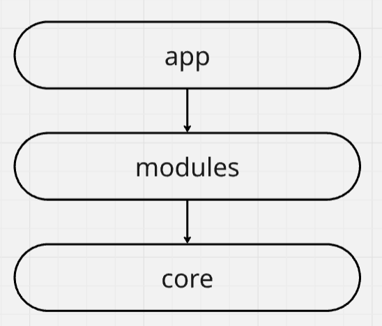
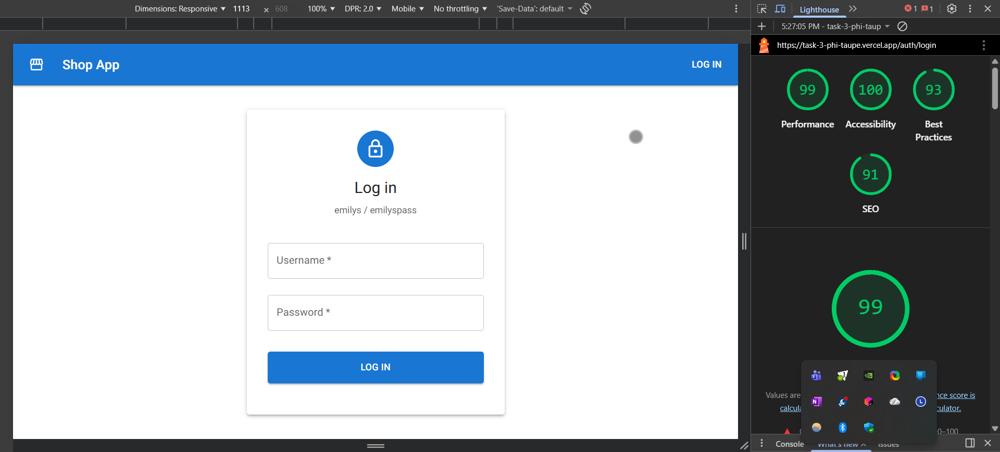
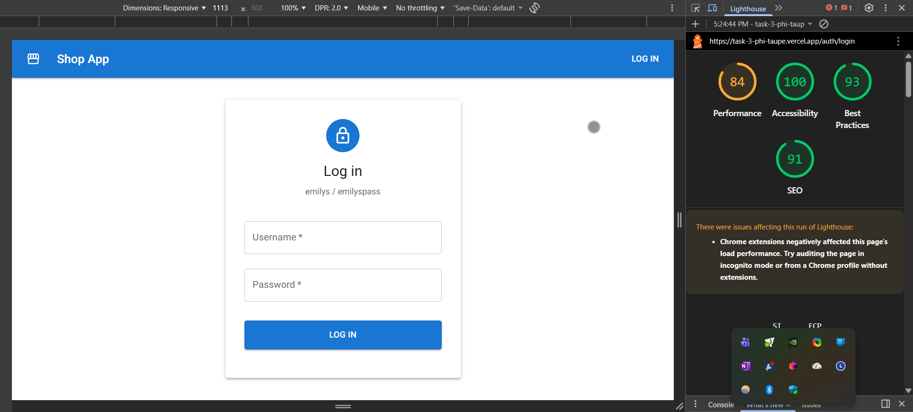
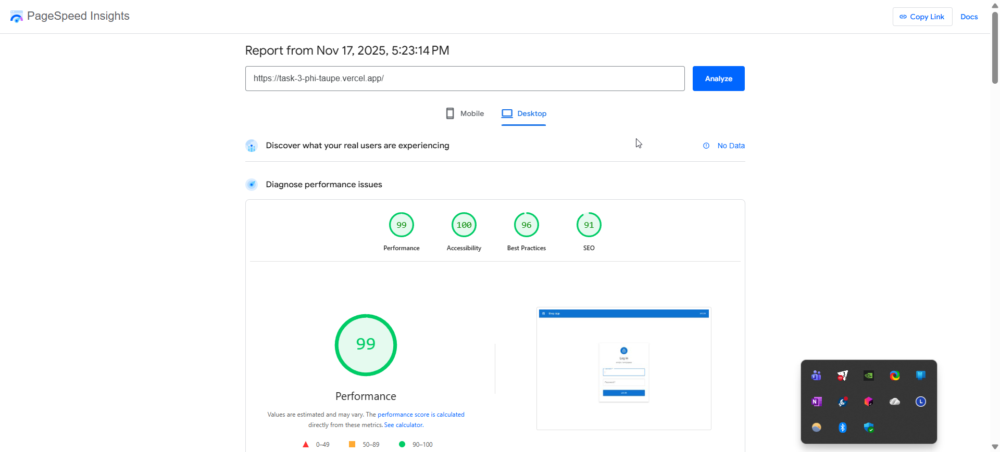
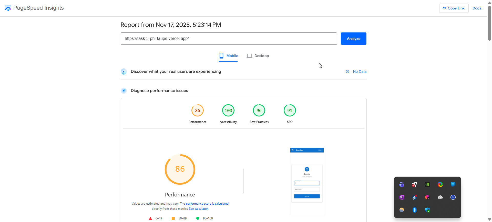
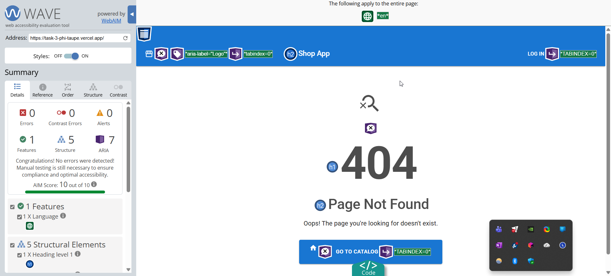
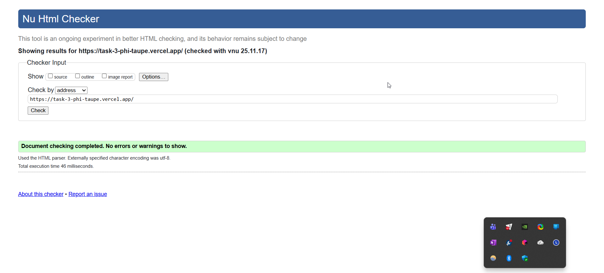

# Task 3 - SPA Application

The application displays product information including details like names, prices, descriptions, images.
It is divided into 3 pages - login, product list, detailed product information

The application is built using:
* React
* React Router
* Redux Toolkit / RTK Query
* Material UI
* REST API (https://dummyjson.com/)
* Webpack
* TypeScript

## 🔗 Links

[Live Demo](https://task-3-phi-taupe.vercel.app/)

## 🚀 Getting Started

Follow these steps to run the project locally on your machine.

<br/>**Clone the repository**

```bash
git clone git@github.com:sergey-mikhovich/task-3.git
```

<br/>**Installation**

Install the project dependencies. Run the following in terminal:

```bash
npm install
```

<br/>**Running the Project**

Once the installation is complete, run the following command to run the project:

```bash
npm run start
```

Open [http://localhost:5000](http://localhost:5000) with your browser to see the result.

## 🌳 App architecture:

* App - core application setup
* Modules - feature-based modules (domain logic)
* Core - centralized location for cross-functional logic



## 📝 Performance & Accessibility Reports

<br/>**Lighthouse Audit Results**

Desktop:



Mobile:



<br/>**PageSpeed Insights**

Desktop:



Mobile:



<br/>**WAVE Accessibility Evaluation**



<br/>**W3C Markup Validation**

